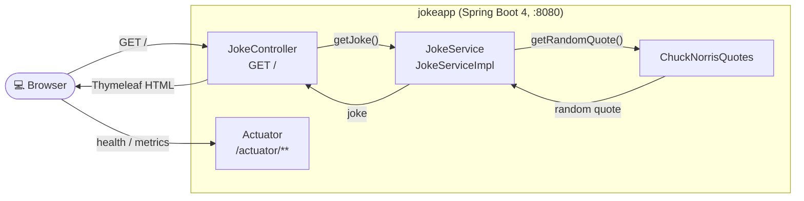

# Jokeapp - Chuck Norris Joke Generator

## Description

Jokeapp is a Spring Boot application that generates and displays random Chuck Norris jokes. The application uses the `ChuckNorrisQuotes` library to generate jokes and presents them through a simple web interface.

## Architecture Overview



## Features

- Generation of random Chuck Norris jokes via the `ChuckNorrisQuotes` library
- Display of jokes via a Thymeleaf web interface
- Spring Boot Actuator with liveness/readiness probes and build/git/java info
- Micrometer metrics (Prometheus registry) and optional OpenTelemetry tracing
- Structured JSON logging via Logstash Logback Encoder

## Technologies

- Java 25
- Spring Boot 4.1.1
- Thymeleaf for template rendering
- Spring Boot Actuator, Micrometer (Prometheus), OpenTelemetry
- Lombok and Logstash Logback Encoder
- Maven Wrapper for dependency management and build process
- Docker for containerization
- Helm for Kubernetes deployment

## Prerequisites

- Java Development Kit (JDK) 25
- Maven Wrapper is bundled (`./mvnw`); no local Maven installation required
- Docker (optional for container builds)
- Kubernetes cluster (optional for Helm deployment)

## Build & run

- Full build (format checks, unit + integration tests, Helm lint/template): `./mvnw clean verify`
- Unit tests only: `./mvnw test`
- Start locally: `./mvnw spring-boot:run`

See [`AGENTS.md`](./AGENTS.md) for formatting, test conventions and deployment details.

## Sandbox (local dev environment)

The sandbox is provisioned by the opencode-sandbox-kit and runs as a Docker container. It mounts this
repo, starts the agent, and connects the IntelliJ MCP server.

Allow the kit source (GitHub without cloning):

```powershell
sbx settings set kit.allowedSources --% "[\"docker.io/\",\"github.com/dboeckli/\"]"
```

Start a new sandbox:

```powershell
sbx run opencode `
    --kit "git+https://github.com/dboeckli/opencode-sandbox-kit.git#dir=opencode-agent" `
    --template docker/sandbox-templates:opencode-docker-0.5.0 `
    --no-share-skills `
    --static-mcp idea `
    . `
    "C:\development\maven-repo:ro"
```

Start the sandbox with Kubernetes support:

```powershell
sbx run opencode `
    --kit "git+https://github.com/dboeckli/opencode-sandbox-kit.git#dir=opencode-agent" `
    --template docker/sandbox-templates:opencode-docker-0.5.0 `
    --no-share-skills `
    --static-mcp idea `
    . `
    "C:\development\maven-repo:ro" `
    "$env:USERPROFILE\.kube:ro"
```

Claude variant (Home):

```powershell
sbx run claude `
    --kit "git+https://github.com/dboeckli/opencode-sandbox-kit.git#dir=opencode-agent" `
    --template docker/sandbox-templates:claude-code-docker-0.5.0 `
    --no-share-skills `
    --static-mcp idea `
    . `
    "C:\development\maven-repo:ro"
```

Mammouth (template pin lives in the spec image):

```powershell
sbx run "git+https://github.com/dboeckli/opencode-sandbox-kit.git#dir=mammouth-agent" `
    --no-share-skills `
    --static-mcp idea `
    . `
    "C:\development\maven-repo:ro"
```

Apply the kit to an existing sandbox (restarts the sandbox, VM state is kept):

```powershell
sbx kit add <sandbox-name> "git+https://github.com/dboeckli/opencode-sandbox-kit.git#dir=opencode-agent"
```

> **Sandbox quirk:** the kit sets `npm_config_bin_links=false` globally, so `./mvnw` works out of
> the box (Spotless/prettier would otherwise fail with EPERM on the mounted workspace).

## Webapp

- Web UI: `http://localhost:8080` (local) or `http://localhost:30080` (Kubernetes NodePort)
- Actuator: `http://localhost:8080/actuator` (health, info, metrics, prometheus)

## Deployment

Deployment is Helm-only. The CI workflows (`.github/workflows/`) build the image, package the
chart and deploy it; locally the IntelliJ run configurations `deploy-k8s`, `test-k8s`,
`uninstall-k8s` and `clear docker` (`.run/scripts/`) wrap the steps below.

### Deployment with Helm

Be aware that we are using a different namespace here (not default).

To run maven filtering for destination target/helm

```bash
./mvnw clean install -DskipTests
```

Go to the directory where the tgz file has been created after 'mvn install'

```powershell
cd target/helm/repo
```

unpack

```powershell
$file = Get-ChildItem -Filter jokeapp-chart-*.tgz | Select-Object -First 1
tar -xvf $file.Name
```

install

```powershell
$APPLICATION_NAME = Get-ChildItem -Directory | Where-Object { $_.LastWriteTime -ge $file.LastWriteTime } | Select-Object -ExpandProperty Name
helm upgrade --install $APPLICATION_NAME ./$APPLICATION_NAME --namespace jokeapp --create-namespace --wait --timeout 8m --debug --render-subchart-notes
```

show logs

```powershell
kubectl get pods -l app.kubernetes.io/name=$APPLICATION_NAME -n jokeapp
```

replace $POD with pods from the command above

```powershell
kubectl logs $POD -n jokeapp --all-containers
```

test

```powershell
helm test $APPLICATION_NAME --namespace jokeapp --logs
```

uninstall

```powershell
helm uninstall $APPLICATION_NAME --namespace jokeapp
```

delete all

```powershell
kubectl delete all --all -n jokeapp
```

create busybox sidecar

```powershell
kubectl run busybox-test --rm -it --image=busybox:1.36 --namespace=jokeapp --command -- bash
```

You can use the actuator rest call to verify via port 30080
